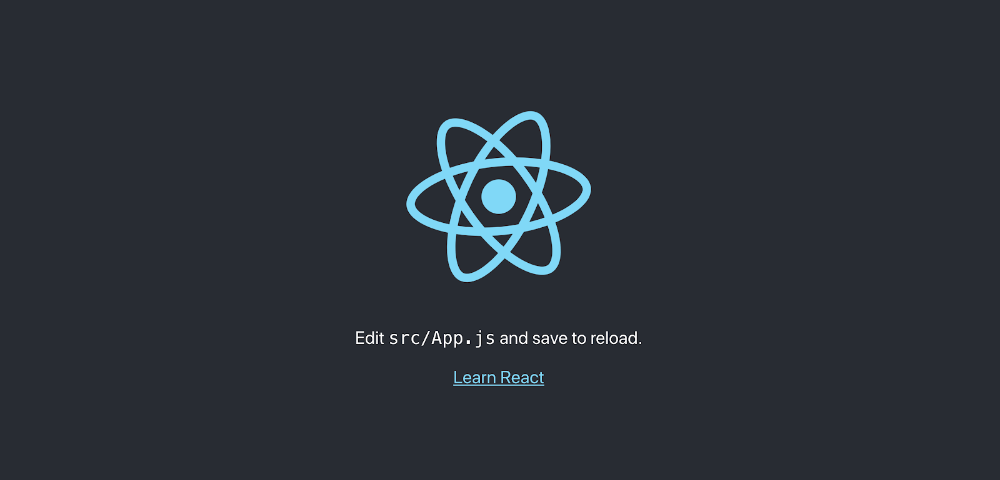
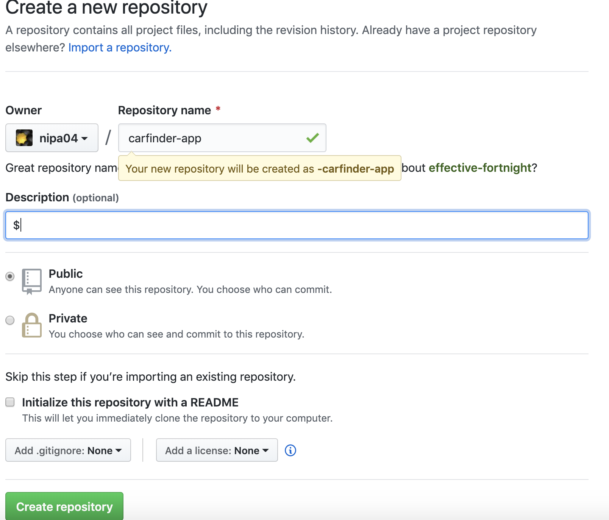
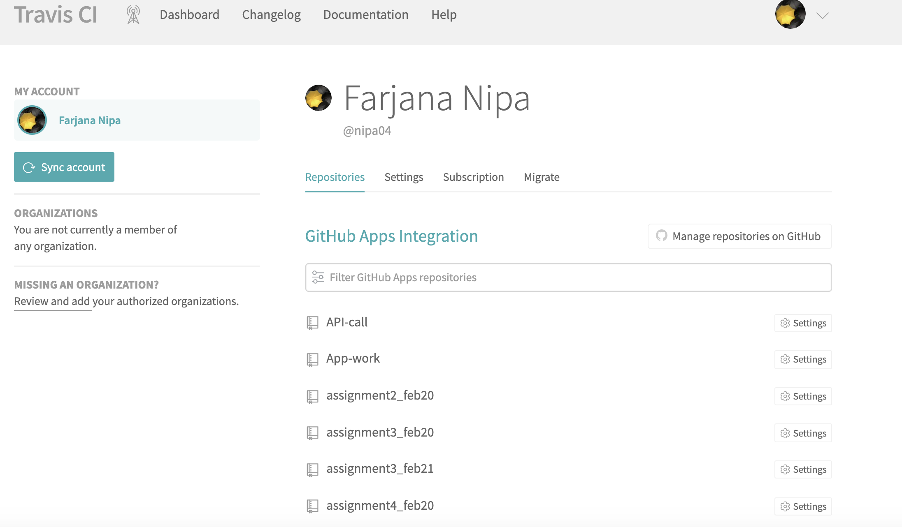
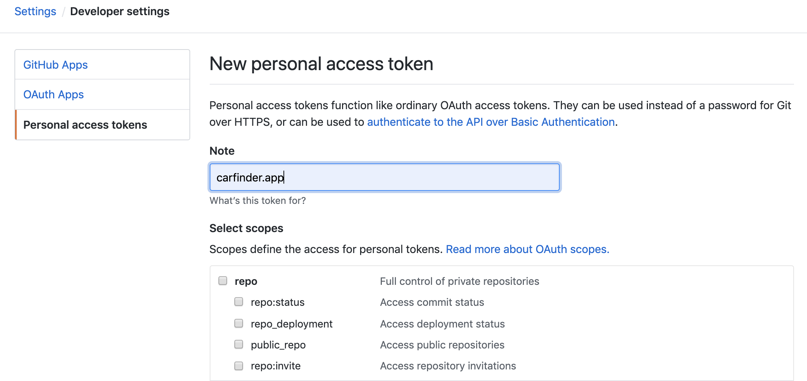
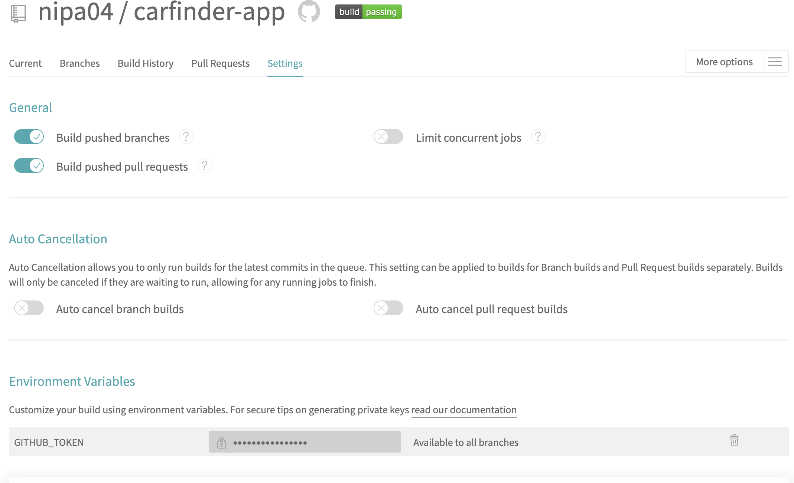
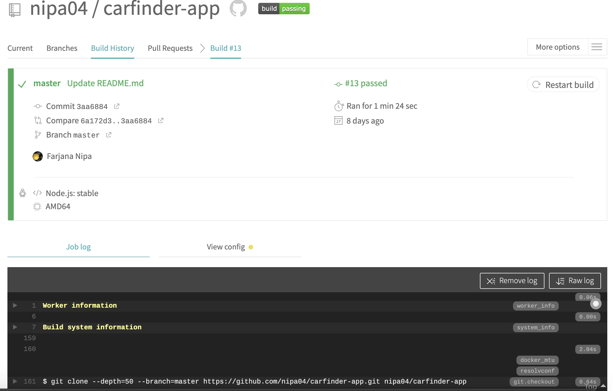
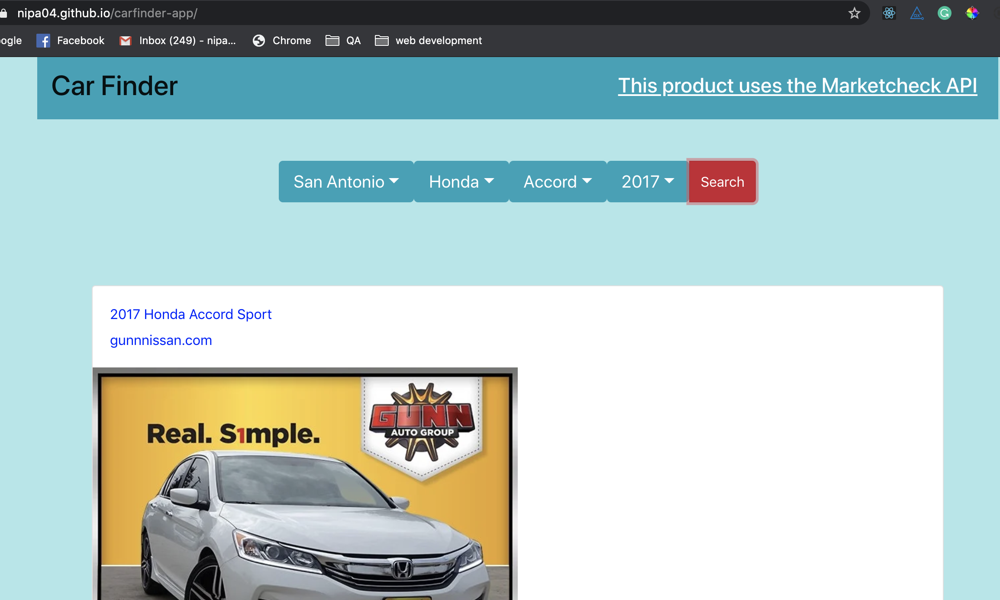

# Continuous Integration and Continuous Delivery & Deployment                        

Working with a team always needs efficiency, and efficiency comes from a better process. To my understanding, CI/CD is nothing but an excellent method to make the team efficient. It is crucial to understand the problems CI and CD solve to use them properly. It will allow your team to improve your process. And avoid putting effort chasing fancy metrics that do not bring any value to your operation. Disclaimer I don't have enough experience to work in a bigger team, but what I'm going to explain here is my theoretical understanding and then try to apply in my projects.

#### Scops
- Git workflow
- CI/CD using Travis CI and GitHub

## Git workflow
Any software development work starts with git, and for better productivity, security, and efficiency having a good git-flow is a must. There are a couple of points you must need to agree on git workflow:
Define mainline like master and develop in most common
Make sure those are protected
When we have this rule in place, then a possible workflow could be:
The developer always start work by creating a feature branch
When task complete feature branch must open PR (pull request) against develop
After PR review code get merge to develop
Develop will open a PR end of the work sprint and merge to master
Master must be ready to deploy anytime
If there is any issue arise then we can use hotfix branch from master, then PR join back to the master

## Continuous integration (aka CI)
We may ask what's the problem we are trying to solve if we have an excellent git-workflow. Well, CI is a team problem, not any tooling problem or engineering problem. CI solves the team scaling problem.
The scenario we want to avoid is that a faulty commit makes it to the main branch. Defective means the code does not compile, or the app won't start or is unusable. Why? Not because the app is broken or because all tests must always be green. That is not a problem, and you can very well never deploy that version and wait for a fix.
The problem is that your entire team is stuck. All the developers who pulled the faulty commit will spend 5 minutes wondering why it doesn't work. Several will probably try to find the defective commit. Some will try to fix the issue by themselves in parallel with the faulty code author.
This is a waste of time for your team. The worst part is that repeated incidents fuel mistrust of the main branch and encourages developers to work apart.

## Continuous Delivery and Deployment (aka CD)
CD is an engineering problem to solve. When the team merges their PR, it's time to make sure we can run all tests, and sanity check then produces the build. CD is nothing but:
The integrity of your production build
Making sure the developer can merge as many features as they can without breaking the integrity.

## CI/CD using Travis CI and GitHub
Here I am deploying one of my project React-App named Car finder on `GitHub`    Pages via `Travis CI`. I am going through the creation of a primary pipeline to deploy the project Car finder.

### About the project Car finder
This project is using open API to search Cars!  Using the​ ​Marketcheck Cars Search API​, I built a react-app that uses a different filter. Like I can accepts car manufacturer, model, and year and search nearby dealerships for local inventory (within 10 km radius) closest to the user and be able to switch cities (i.e., select Montreal over Toronto). 

To develop this project, I will need NodeJS and a free account on [https://www.marketcheck.com/automotive](https://www.marketcheck.com/automotive), which will serve as the necessary data from the API for the app.

### Scaffold the project and load the code on a repository
First, I created a basic React application using a create-react-app tool and then check if everything is working correctly.

	npx create-react-app carfinder-app
	cd carfinder-app
	npm start

Something similar should appear on your browser, at `http://localhost:3000/`

I created a repository on GitHub and uploaded the starter code

From the root folder of the project I ran

		git remote add origin https://github.com/nipa04/carfinder-app.git
 		git push -u origin master
 	
### Create the file .travis.yml

Created a new file .travis.yml in the root folder of the project carfinder-app.

	language: node_js
	 node_js:
	 - "stable"
	 cache:
	 directories:
	   - node_modules
	 script:
	 - npm test
	 - npm run build

This file contains all the instructions for Travis CI to test and build the project. I have to push this file to the repository (on the master branch).

### Create an account on Travis CI
I am using Travis CI for deploying my project. Travis CI is a hosted continuous integration service (managed service) used to build and test software projects hosted at GitHub. Here is the site [https://travis-ci.org](https://travis-ci.org), and you can sign in with GitHub.
Then by clicking on the avatar, the list of all repositories on GitHub was shown. By clicking on the “Sync account,” it would take a couple of seconds for sync with the GitHub account.

### Generate the GitHub token and update the file .travis.yml

Now need to generate the GitHub token and in Travis CI and created an Environment Variable **GITHUB_TOKEN** and past the token in the **Value field**.

 	

Now I go back to the file .travis.yml and add these lines at the   end

	deploy:
	 provider: pages
	 skip_cleanup: true
	 github_token: $GITHUB_TOKEN
	 local_dir: build
	 on:
	   branch: master
	
	

### Update the file package.json
Then I added the `homepage` property to the package.json file

	homepage: "https://nipa04.github.io/carfinder-app/",

Now pushed again the updated code on the master branch and open Travis CI dashboard. At first, the build was failed due to no test to build then I wrote the command to pass with no test. After that, the build passed. Here is the final **travis.yml** file look like:

	language: node_js
	node_js:
	 - "stable"
	cache:
	 directories:
	   - node_modules
	script:
	 - npm test
	 - npm run build || true
	deploy:
	 provider: pages
	 skip_cleanup: true
	 github_token: $GITHUB_TOKEN
	 local_dir: build
	 on:
	   branch: master
	

Building!

The bottom of the logs should see something like

	Preparing deploy
	Deploying application
	Done. Your build exited with 0.
	
So carfinder-app is now deployed and available at the URL specified before in the **package.json** as **“homepage”** and that is  [https://nipa04.github.io/carfinder-app/](https://nipa04.github.io/carfinder-app/).

## Conclusion

It’s a simple but efficient CI/CD pipeline and can be empowered by adding custom configuration in the .travis.yml file.

Github Link for the project : [https://github.com/nipa04/carfinder-app](https://github.com/nipa04/carfinder-app)

